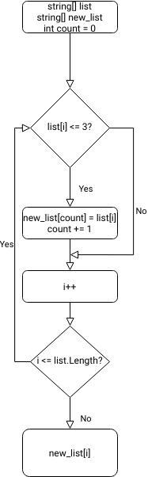

# Контрольная работа 
# Задача 
## Написать программу, которая из имеющегося массива строк формирует массив из строк, длина которых меньше либо равно 3 символа. 
### Решение:
### 1. Объявление исходного массива;
    2. Объявление пустого массива, размером не меньше исходного;
    3. Объявление переменной для индексации нового массива;
    4. Проход по всем элементам исходного массива;
    4.1 Проверка условия "длина элемента <= 3";
    4.2 Если "да" - запись элемента в новый массив;
    5. Вывод нового массива на экран.
---

> Ниже прилагается блок-схема решения данной задачи.

